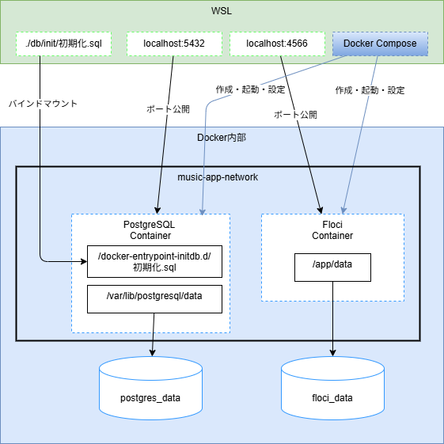
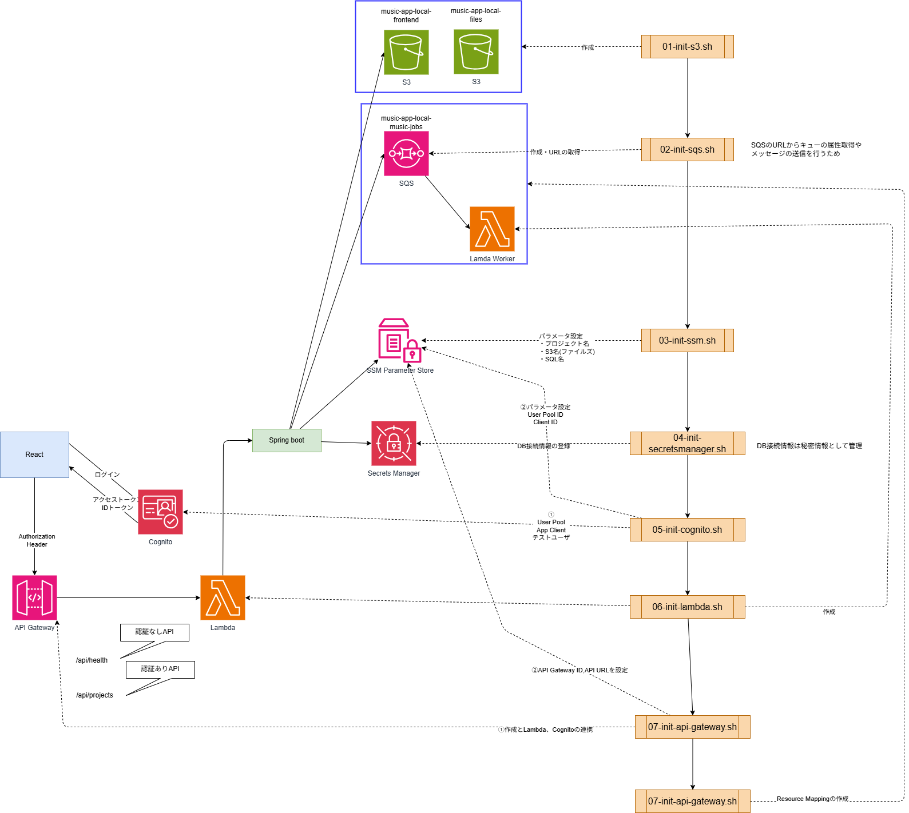

## 構成の説明

 - **services**：Docker Compose で起動するアプリケーション単位のコンテナ定義
 - **volumes**
   - コンテナからアクセスできる保存領域やホスト側ディレクトリをマウントする設定
   - 名前付きボリュームは Compose のトップレベル volumes に定義して再利用できる
 - **networks**：コンテナ同士を接続させる仕組み
   - ホスト→コンテナ：localhost:ポート番号
   - コンテナ→コンテナ：サービス名:ポート番号

## 詳細

### 全体像

### Postgresコンテナ

   - ソフトウェア：PostgreSQL16
   - コンテナ名：music-app-postgres
   - PC側のポート:コンテナ側のポート：5432:5432
   - コンテナ起動時に渡す環境変数
     - 初期作成するDB名：music_app
     - 初期作成するユーザー名：app_user
     - ユーザーのパスワード：app_password
   - ヘルスチェック
     - pg_isready でDB接続可能か確認
     - インターバル：10秒ごとに確認
     - タイムアウト：1回の確認を最大5秒待つ
     - リトライ：10回失敗したら異常扱い

### Floci コンテナ

**Floci**：ローカルPC上で AWS API に似た動きを再現するオープンソースの AWS エミュレーター

 - ソフトウェア：floci
   - コンテナ名：music-app-floci
   - PC側のポート:コンテナ側のポート：4566:4566
   - コンテナ起動時に渡す環境変数
     - デフォルトリージョン：music_app
     - ホスト名：app_user
     - ストレージモード：維持
     - 永続化するローカルパス：/app/data

 | サービス                 | 作成するリソース                            | 用途                             |
| -------------------- | ----------------------------------- | ------------------------------ |
| S3                   | `music-app-local-frontend`          | React 配信用ファイル保存先の想定            |
| S3                   | `music-app-local-files`             | 楽曲・音声・プロジェクトファイル保存             |
| SQS                  | `music-app-local-music-jobs`        | 音源書き出し等の非同期処理                  |
| SSM                  | `/music-app/local/app-name`         | アプリ名設定                         |
| SSM                  | `/music-app/local/file-bucket-name` | ファイル保存先バケット名                   |
| Secrets Manager      | `music-app/local/db`                | PostgreSQL 接続情報                |
| Cognito              | `music-app-local-users`             | 認証用 User Pool                  |
| Cognito              | `music-app-local-web-client`        | React 用 App Client             |
| Cognito              | `local-user@example.com`            | ローカル確認用ユーザー                    |
| Lambda               | `music-app-local-api-handler`       | API Gateway 疎通確認用の仮 API Lambda |
| Lambda               | `music-app-local-music-job-worker`  | SQS 疎通確認用 Worker Lambda        |
| API Gateway          | `music-app-local-api`               | React から呼び出す REST API          |
| API Gateway          | `GET /api/health`                   | 認証なし API                       |
| API Gateway          | `GET /api/projects`                 | Cognito 認証付き API               |
| Event Source Mapping | SQS → Worker Lambda                 | 非同期処理連携                        |

### フォルダ構成

※環境変数を変更してもすでに既存DBには反映されないためボリュームも削除する必要がある